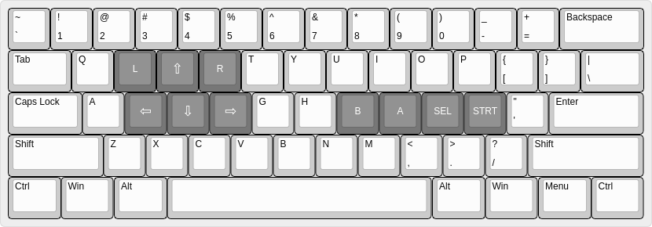

Crab is a Game Boy, Game Boy Color, and Game Boy Advance emulator written in Crystal. Game Boy and Game Boy Color emulation are very accurate, while Game Boy Advance is considered playable in many games.

The Game Boy and Game Boy Color emulator come from my [CryBoy](https://github.com/mattrbeck/CryBoy) project, which has been ported into this codebase to reduce common logic and bugs between the two. The one downside here is the longer build time thanks to Crystal's slow compilation in release mode.

The Game Boy and Game Boy Color work would not be possible without the [Pan Docs](https://gbdev.io/pandocs), [izik's opcode table](https://izik1.github.io/gbops), the [gbz80 opcode reference](https://rednex.github.io/rgbds/gbz80.7.html), [The Cycle-Accurate Game Boy Docs](https://github.com/AntonioND/giibiiadvance/blob/master/docs/TCAGBD.pdf), or gekkio's [Game Boy: Complete Technical Reference](https://gekkio.fi/files/gb-docs/gbctr.pdf). The Game Boy Advance work would not be possible without [GBATEK](http://problemkaputt.de/gbatek.htm), [Tonc](https://www.coranac.com/tonc), [mGBA](https://mgba.io/), or the wonderful emudev community.

## Building

[SDL2](https://www.libsdl.org/) is the only library you should need to install. It is available on every major package manager. If you're on Mac, I believe you'll also need to install cmake, although I can't confirm. Of course, the assumption is also that you have the [Crystal](https://crystal-lang.org/install/) compiler installed.

After cloning the repository, all you'll need to do is run `shards build --release` to build the emulator in release mode. This will place the binary at `bin/crab`.

## Usage

Running the emulator is as simple as running the `crab` executable generated under the `bin` directory. If you'd rather launch a specific rom directly, you can pass it as a command-line argument along with an optional bios, like `bin/crab /path/to/bios /path/to/rom`.

If you omit the GBC BIOS for a GB game, it will select a default 4-color palette that will not be the one typically set by the GBC BIOS.

Currently, I ship the emulator with the [Cult of GBA BIOS](https://github.com/Cult-of-GBA/BIOS) created by Fleroviux and DenSinH for your convenience. Like [Normatt's replacement BIOS](https://github.com/Nebuleon/ReGBA/tree/master/bios), this BIOS aims to implement much of the functionality of the official GBA BIOS. Both of these BIOSes should be compatible in most cases, although the official BIOS will always be the most accurate. If you want greater accuracy, it'd be good to get your hands on an official copy of the BIOS or dump it from your GBA/DS/3DS yourself.

### Controls

Keybindings are completely configurable through the UI, so you can set them to however you're most comfortable.  Controllers are also supported. The default keybindings are tuned for my personal preferences.

### Pixel-Accurate GB / GBC Rendering

To enable the experimental FIFO renderer (as opposed to the scanline renderer), you can run the emulator with the `--fifo` flag. The current FIFO implementation should work identically to the scanline renderer with the exception that it does not render sprites on column 0 of the LCD. However, it will play games like Prehistorik Man more accurately than the scanline renderer would since that game relies on a cycle-accurate PPU implementation.

## Features and Remaining Work

### Features
- Frontend
  - Open ROMs
  - Select BIOS
  - Rebind keys
  - Toggle syncing
- GB / GBC
  - Accurate sound emulation
  - GLSL shaders for color reproduction
  - Controller support
  - Passing [blargg's CPU tests](https://github.com/retrio/gb-test-roms/tree/master/cpu_instrs)
  - Passing [blargg's instruction timing tests](https://github.com/retrio/gb-test-roms/tree/master/instr_timing)
  - Passing [blargg's memory timing tests](https://github.com/retrio/gb-test-roms/tree/master/mem_timing)
  - Passing [blargg's Game Boy Color sound tests](https://github.com/retrio/gb-test-roms/tree/master/cgb_sound)
  - Passing [mooneye-gb timer tests](https://github.com/Gekkio/mooneye-gb/tree/master/tests/acceptance/timer)
  - PPU draws background, window, and sprites
  - PPU offers both scanline and FIFO rendering modes (behind a runtime flag)
  - Save files work as intended, and are compatible with other emulators like BGB
  - MBC1 cartridges are supported (except for multicarts)
  - MBC2 cartridges are fully supported
  - MBC3 cartridges are supported (except timers)
  - MBC5 cartridges are supported
  - Game Boy Color support, including HDMA, double-speed mode, and palettes
- GBA
  - Accurate sound emulation (both Direct Sound and PSGs)
  - GLSL shaders for color reproduction
  - Controller support
  - PPU features
    - Modes 0-5 are mostly implemented
    - Affine backgrounds and sprites
    - Alpha blending
    - Windowing
  - CPU core
    - Passing [armwrestler](https://github.com/destoer/armwrestler-gba-fixed)
    - Passing [FuzzARM](https://github.com/DenSinH/FuzzARM)
    - Passing [gba-suite](https://github.com/jsmolka/gba-suite)
  - Storage
    - Flash
    - SRAM
    - EEPROM
  - Timers run effeciently on the scheduler
  - Real-time clock support

### Remaining Work
- GB / GBC
  - Picture processing
    - Pixel FIFO
      - I've made lots of progress into the FIFO renderer. There are still a couple of issues that I have yet to resolve, though. The main one that seems to be specific to the pixel FIFO renderer is that I don't render sprites on column 0 of the LCD, although I still do render the rest of the sprite in its correct position even if the sprite's x position is less than 8
  - Misc
    - MBCs
      - MBC 5 rumble
      - RTC (decide if I want it to stick with real time or CPU time, or make it configurable)
      - Fixing an issue when ROMs misreport their size
    - Other hardware bugs tested in blargg's test suite
- GBA
  - PPU
    - Mosaic
    - Blending code needs cleanup
  - Storage
    - Game database to support odd cases like Classic NES and ROMs that misreport things like RTC
  - Timing
    - Cycle counting
    - DMA timing
    - Prefetch
    - Etc, etc, etc.
- Debugger for both GB and GBA

## Special Thanks

A special thanks goes out to those in the emudev community who are always helpful, both with insightful feedback and targeted test ROMs.

- https://github.com/ladystarbreeze
- https://github.com/DenSinH
- https://github.com/fleroviux
- https://github.com/destoer
- https://github.com/GhostRain0

## Contributing

1. Fork it (<https://github.com/mattrbeck/crab/fork>)
2. Create your feature branch (`git checkout -b my-new-feature`)
3. Commit your changes (`git commit -am 'Add some feature'`)
4. Push to the branch (`git push origin my-new-feature`)
5. Create a new Pull Request

## Contributors

- [Matthew Beck](https://github.com/mattrbeck) - creator and maintainer
